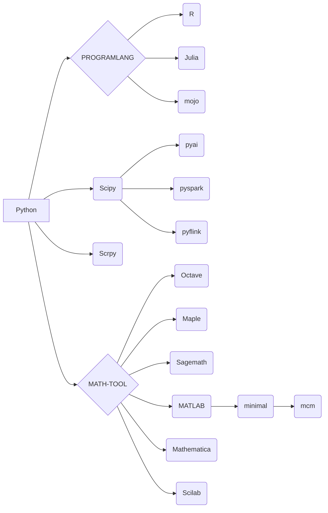

# jupyter-image-stacks

## Jupyter For Data-Science

English | [中文](README_CN.md)

**THIS doc for non-CN USER**

**dockerhub: https://hub.docker.com/r/ben0i0d/jupyter**

### HOW TO USE
**Docker**
* No data is used persistently：`docker run -d -p 8888:8888 docker.io/ben0i0d/jupyter:<tag>`  
* Provide data for persistent use：`docker run -d -p 8888:8888 -v "${PWD}":/home/jovyan docker.io/ben0i0d/jupyter:<tag>`

**Jupyterhub**  
Specify the image in the profile of the singleuser
```
- description:  SCIPython, for scientific research and engineering applications.
    display_name: Scipy
    kubespawner_override:
        image: docker.io/ben0i0d/jupyter:scipy-c
```
### Global description
1. If you build or fork the image yourself, replace the base image in the Dockerfile with the image on DockerHub
2. For commercial software such as Mathematica, MATLAB, etc., we only provide packaging, and the specific activation method and possible consequences are borne by the user
### List of images that are currently being built
* Upstream: Mirror upstream, benchmarking against the jupyter official minimal-notebook image
    * Description
        1. Upstream has switched to `debian:bookworm-slim`, and GPU upstream images are also built based on `debian:bookworm`
        2. By default, we add the domain certificate of eoelab.org, which does not pose any security issues
        3. Sudo is added for passwordless use. In scenarios with high security requirements, do not allow privilege escalation
        4. Provided packages: file compression/extraction (.zip), project management (git), Chinese fonts (fonts-wqy-zenhei)
* Python: Supports Python , combining Python syntax with the ecosystem for production and research.
    * Scipy: Provides a scientific computing environment for Python, offering rich numerical computation, optimization, signal processing, statistical analysis, etc., for scientific research and engineering applications.
    * Scrpy: Provides a web scraping environment for Python, used for extracting data from the internet, automating information gathering and analysis tasks, suitable for data mining, web scraping, and business intelligence collection applications.
    * pyspark: Provides a Python-based Spark programming interface for large-scale data processing and analysis, offering powerful parallel computing capabilities and rich data manipulation functions, suitable for efficient data processing and machine learning tasks in distributed environments.
    * pyflink: Provides a Python-based Flink programming interface for stateful computation of unbounded and bounded data streams. It also offers batch processing APIs for processing batch data computations based on stream computing engines.
    * pyai (With GPU): Provides a common AI toolchain, offering a rich set of deep learning frameworks and NLP model libraries, enabling developers to easily build and train various AI models for applications in image recognition, natural language processing, etc.
* Julia: Supports Julia, a high-performance, dynamic programming language designed for scientific computing and data analysis, with readability similar to Python and execution speed similar to C.
    * Description:
        1. Environment variable `JULIA_NUM_THREADS` in Julia image, please configure according to desired concurrency threads at startup.
* R: Supports R, a programming language for statistical analysis and data visualization, with rich data processing libraries and powerful statistical functions, widely used in data science and research fields.
* Sagemath: An open-source mathematical computation system that combines multiple mathematical packages, providing extensive mathematical functions such as numerical computation, symbolic computation, discrete mathematics, and statistical analysis. It is also an interactive computing environment, convenient for mathematical modeling, algorithm design, and academic research.
* Scilab (With Desktop-GUI): An open-source numerical computing software, suitable for numerical analysis, data visualization, simulation, and modeling in scientific and engineering fields. It provides a rich set of mathematical functions and toolboxes, supports matrix computation, symbolic computation, and plotting functions, is a powerful mathematical tool, especially suitable for education and research fields, provides Xfce desktop support, and includes all plugins available through APT.
* Octave: An open-source numerical computing software similar to Matlab, used for scientific computing, data analysis, and numerical simulation. It provides powerful matrix operations, plotting functions, and rich numerical analysis functions, a free and convenient tool suitable for mathematical modeling, algorithm development, and teaching tasks, includes all plugins available through APT.
* Maple: A mathematical software that provides a powerful mathematical engine through an intelligent file interface, enabling easy analysis, exploration, visualization, and solving of mathematical problems.
    * Description
        1. Upload `license.dat libmaple.so` to the main directory. Each time the environment is started, run `sudo cp license.dat /opt/maple/license && sudo cp libmaple.so /opt/maple/bin.X86_64_LINUX/` to activate before use.
* Mathematica: A scientific computing software that provides powerful and convenient features for data analysis, mathematical computation, and other fields.
    * Description
        1. Each time the environment is started, run `WolframKernel` to manually activate. View activation code at `https://mmaactivate.github.io/MMAActivate/`. If activation fails multiple times, run `rm /home/jovyan/.Mathematica/Licensing/mathpass` to delete previous license records.
        2. If you have an account, use web verification/online verification.
        3. THIS IS NOT READY NOW , kernel is stuck connecting.
* MATLAB: A programming and numerical computing platform that supports data analysis, algorithm development, and modeling.
    * Description
        1. Upload `license.lic libmwlmgrimpl.so` to the main directory. Each time the environment is started, run `sudo cp license.lic /opt/matlab/r2023b/licenses/ && sudo cp libmwlmgrimpl.so /opt/matlab/r2023b/bin/glnxa64/matlab_startup_plugins/lmgrimpl/` to activate before use.
        2. If you have an account, use web verification/online verification.
    * minimal: Contains only `Product:MATLAB`
    * mcm: Contains toolboxes required for mathematical modeling.


### List of plugins

**Global**
* jupyterlab-language-pack-zh-CN:Support for Chinese
* jupyterlab_tabnine：It is used for autocompletion, parameter suggestion, function document query, and jump definition

**Part**

### Image dependencies


## Upstream

**Package version**
* cuda 12.2.0
* Python 3.11
* Julia latest
* spark 3.5.1
* flink 1.19.0
* jupyterlab 4
* Matlab R2023b
* Mathematica 14.0
* Maple 2023

**Mirror source**
* pip bfsu：https://mirrors.bfsu.edu.cn/help/pypi/
* apt ustc：https://mirrors.ustc.edu.cn/help/debian.html
* apache ustc: https://mirrors.ustc.edu.cn/apache/
* julia-pkg ustc: https://mirrors.ustc.edu.cn/julia/
* CRAN ustc：https://mirrors.ustc.edu.cn/CRAN/

### Upstream of the project
https://github.com/jupyter/docker-stacks

**However, we are quite different from the upstream in terms of sources, packages, localizations, extensions, etc., so if you have a problem with this project, please do not ask the Jupyter team questions, as it will increase their workload**

### kernel
* Python：https://ipython.org/
* Julia: https://github.com/JuliaLang/IJulia.jl
* R: http://irkernel.github.io/
* Octave: https://github.com/Calysto/octave_kernel
* MATLAB: https://github.com/mathworks/jupyter-matlab-proxy
* MMA: https://github.com/WolframResearch/WolframLanguageForJupyter

## Necessary copyright notice
For code derived from other teams, we added the original copyright notice to the file header, and we retain and support the copyrights of other development teams