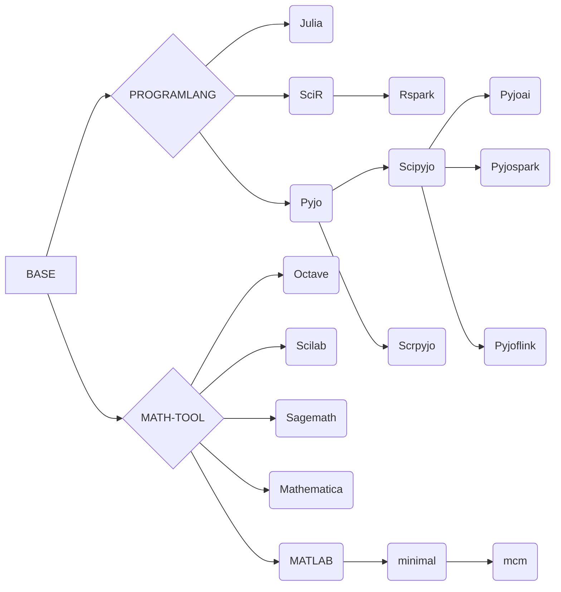

# jupyter-image-stacks

English | [中文](README_CN.md)

**为中国用户的文档**

**我们的docker镜像仓库是 https://hub.docker.com/r/ben0i0d/jupyter**

## Jupyter 项目为了数据科学

我们决定移除一些镜像，因为它们不被维护且不适合生产用途，我们计划使用coder与denv项目等补全

### 如何使用
**Docker**
* 没有数据持久化地使用：`docker run -d -p 8888:8888 ben0i0d/jupyter:<tag>`  
* 提供数据持久化地使用：`docker run -d -p 8888:8888 -v "${PWD}":/home/jovyan ben0i0d/jupyter:<tag>`

**Jupyterhub**  
在singleuser内的profile指定镜像
```
- description: 提供Python的科学计算环境，提供了丰富的数值计算、优化、信号处理、统计分析等功能，用于科学研究和工程应用。
    display_name: Scipy
    kubespawner_override:
        image: ben0i0d/jupyter:scipy-c
```
### 全局说明
1. 在终端下运行`pip config set global.index-url https://mirrors.bfsu.edu.cn/pypi/web/simple`完成pip换源
2. 如果自行构建或派生，替换dockerfile中的基础镜像为dockerhub上的镜像
3. 对于例如Mathematica，MATLAB等商业软件，我们只提供打包，具体激活方式及可能带来的后果由用户承担
4. 我们默认隐藏`__pycache__`，即在文件浏览器视图中不可见
5. 对于ohmyzsh，在terminal内只需执行以下代码一次即可
```
git clone https://github.com/ohmyzsh/ohmyzsh.git ~/.oh-my-zsh
cp ~/.oh-my-zsh/templates/zshrc.zsh-template ~/.zshrc
```
6. 以下代码适用于解决matplotlib绘图缺失中文字体
```
from matplotlib.font_manager import FontProperties
# 设置中文字体路径
zh_font = FontProperties(fname="/usr/share/fonts/truetype/wqy/wqy-zenhei.ttc")
# 将中文字体设置为默认字体
plt.rcParams["font.family"] = zh_font.get_name()
```
7. 以下代码适用于增加对conda虚拟目录的支持，以实现自定义环境不丢失
    1. 数据持久化
        * docker启动时添加`-v "DATA-VOLUME":/opt/conda/envs/`
        * Jupyterhub添加额外挂载点到`/opt/conda/envs/`
    2. 虚拟环境安装内核  
        * 使用`conda create -n NAME *** ipykernel` 创建这个虚拟环境。使用`source activate NAME`切换到这个虚拟环境，并且添加一个kernel到本地的`.jupyter`目录，使用`python -m ipykernel install --user --name NAME --display-name "DISPLAY-NAME"`完成
### 当前构建镜像清单
* Upstream: 镜像上游，对标jupyter官方的minimal-notebook镜像
    * 说明
        1. 上游已经切换到`debian:trixie`，GPU上游镜像也基于`debian:trixie`二次构建了镜像
        2. 默认情况下我们添加了eoelab.org的域名证书，这不会带来安全问题
        3. 添加了sudo的无密码使用，在安全要求较高的场景中，不要允许特权提升
        4. 提供软件包：SHELL(zsh)，文件压缩/解压(.bz2|.zip|.7z)，项目管理(git|git-lfs),证书管理(ca-certificates)，编辑器（vim）,网络交互（curl|wget）,中文字体（fonts-wqy-zenhei）
* Llinux（With Desktop-GUI）：在无特权的情况下学习Linux系统，提供Xfce桌面支持   
* Pyjo：支持Python与Mojo，通过将python语法与生态系统相结合进行生产与研究，mojo具备元编程特性。我们期待这一环境带来的改进
    * 说明
        1. Mojo被合并进Python,由于网络原因需要手动执行`modular install mojo && python /opt/modular/pkg/packages.modular.com_mojo/jupyter/manage_kernel.py install `完成添加kernel
    * Scipyjo：提供Python的科学计算环境，提供了丰富的数值计算、优化、信号处理、统计分析等功能，用于科学研究和工程应用。
    * Scrpyjo: 提供Python的网页采取环境，用于提取互联网上的数据，实现自动化的信息收集和分析任务，适用于数据挖掘、网络爬虫以及业务情报收集等应用场景。
    * Pyjospark: 提供基于Python的Spark编程接口，用于大规模数据处理和分析，提供了强大的并行计算能力和丰富的数据操作函数，适合在分布式环境中进行高效的数据处理和机器学习任务。
    * Pyjoflink: 提供基于Python的Flink编程接口，用于对无边界和有边界的数据流进行有状态的计算,也提供了批处理API，用于基于流式计算引擎处理批量数据的计算能力。
    * Pyjoai（With GPU）：提供常用AI工具链，提供了丰富的深度学习框架和NLP模型库，使开发人员能够轻松构建和训练各种人工智能模型，并应用于图像识别、自然语言处理等领域。
* Julia：支持Julia，高性能、动态的编程语言，设计用于科学计算和数据分析，具备类似Python的易读性和类似C的执行速度。
    * 说明：
        1. Julia镜像中的环境变量`JULIA_NUM_THREADS`，请在启动时根据理想的并发线程数进行配置
* SciR：支持R的科学计算环境，面向统计分析和数据可视化的编程语言，拥有丰富的数据处理库和强大的统计功能，广泛应用于数据科学和研究领域。
  * Rspark: 提供基于R的Spark编程接口，用于在Spark上运行R代码。提供了R语言在大数据处理和分布式环境中的能力，可以进行高效的数据操作、机器学习和统计分析，适用于大规模数据处理和分析任务。
* Sagemath：一个开源的数学计算系统，结合了多个数学软件包，提供了广泛的数学功能，如数值计算、符号计算、离散数学和统计分析。它也是一个交互式计算环境，方便进行数学建模、算法设计和学术研究。  
* Dotnet: 一个跨平台的开发框架，支持C#、F#、PW，用于构建各种类型的应用程序，包括Web应用、桌面应用和移动应用。它提供了丰富的类库和工具，简化了开发过程，并具有高性能和可扩展性。
* Scilab（With Desktop-GUI）: 开源的数值计算软件，适用于科学和工程领域中的数值分析、数据可视化、模拟和建模。它提供了丰富的数学函数和工具箱，支持矩阵计算、符号计算和绘图功能，是一个强大的数学工具，尤其适用于教育和研究领域，提供Xfce桌面支持，包含APT可获取的全部插件。
* Octave: 开源的数值计算软件，类似于Matlab，用于科学计算、数据分析和数值模拟。它提供了强大的矩阵运算、绘图功能以及丰富的数值分析函数，是一个免费且便捷的工具，适合进行数学建模、算法开发和教学任务，包含APT可获取的全部插件。
* Maple: 一个数学软件，透过智能文件界面提供强大数学引擎，可以轻松分析、探索、可视化和求解数学问题
    * 说明
        1. 将`license.dat libmaple.so`上传至主目录，每一次启动环境时，运行`cp license.dat /opt/maple/license && cp libmaple.so /opt/maple/bin.X86_64_LINUX/`完成激活再使用
* Mathematica:一个科学计算软件，在数据分析、数学计算等领域提供了强大方便的使用功能。
    * 说明
        1. 每一次启动环境时，运行`WolframKernel`完成手动激活，激活码查看`https://ibug.io/blog/2019/05/mathematica-keygen/`，如果多次激活不成功，请运行`rm /home/jovyan/.Mathematica/Licensing/mathpass`删除之前的许可记录
* MATLAB：一种支持数据分析、算法开发和建模的编程和数值计算平台。
    * 说明
        1. 将`license.lic libmwlmgrimpl.so`上传至主目录，每一次启动环境时，运行`cp license.lic /opt/matlab/r2023b/licenses/ && cp libmwlmgrimpl.so /opt/matlab/r2023b/bin/glnxa64/matlab_startup_plugins/lmgrimpl/`完成激活再使用
    * minimal:仅仅包含`Product:MATLAB`
    * mcm:包含数学建模所需要的工具箱

### 插件清单

**全局**
* jupyterlab-language-pack-zh-CN:对中文的支持
* jupyterlab_tabnine：用于自动补全、参数建议、函数文档查询、跳转定义

**局部**

### 镜像依赖关系


## 上游

**软件包版本**
* cuda 12.2.0
* Python 3.11
* Julia 1.9.4
* spark 3.5.0
* jupyterlab 4
* Matlab R2023b
* Mathematica 13.3.1
* Maple 2023

**镜像源**
* conda bfsu：https://mirrors.bfsu.edu.cn/help/anaconda/
* pip bfsu：https://mirrors.bfsu.edu.cn/help/pypi/
* apt ustc：https://mirrors.ustc.edu.cn/help/debian.html
* apache tuna: https://mirrors.tuna.tsinghua.edu.cn/apache/
* julia-pkg ustc: https://mirrors.ustc.edu.cn/julia/

### 项目上游
jupyter团队项目 https://github.com/jupyter/docker-stacks

**但是我们与上游差别较大，包括源，软件包，本地化与扩展等，因此如果您从本项目派生遇到问题，请不要到jupyter团队提问，这会加大他们的工作量**

### kernel
* Python：https://ipython.org/
* Julia: https://github.com/JuliaLang/IJulia.jl
* R: http://irkernel.github.io/
* Octave: https://github.com/Calysto/octave_kernel
* MATLAB: https://github.com/mathworks/jupyter-matlab-proxy
## 必要的版权说明
对于派生自其他团队的代码，我们在文件头添加了原版版权声明，我们保留并且支持其他开发团队版权

